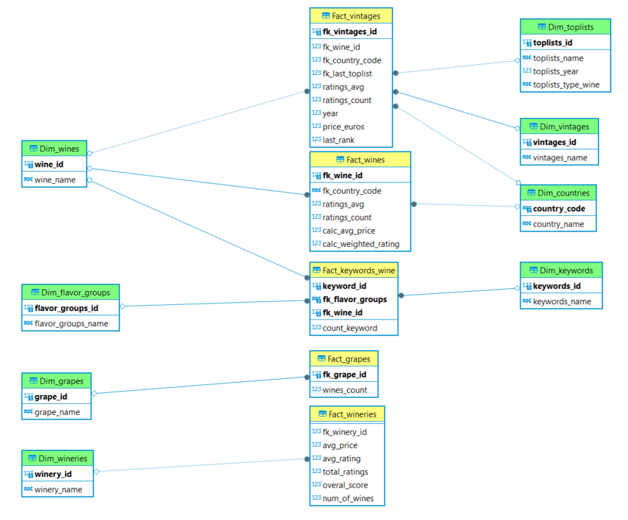

# Wine Market Analysis


## 📝 Description 

This project is about the company Wiwino, proudly active in the wine industry. Data about wines from users for years is gathered and stored in a sqlite database. 
With this as starting point following questions should be answered:

1. We want to highlight 10 wines to increase our sales. Which ones should we choose and why?
2. We have a limited marketing budget for this year. Which country should we prioritise and why?
3. We would like to give awards to the best wineries. Come up with 3 relevant ones. Which wineries should we choose and why?
4. We detected that a big cluster of customers likes a specific combination of tastes. We identified a few keywords that match these tastes: _coffee_, _toast_, _green apple_, _cream_, and _citrus_ (note that these keywords are case sensitive ⚠️). We would like you to find all the wines that are related to these keywords. Check that **at least 10 users confirm those keywords**, to ensure the accuracy of the selection. Additionally, identify an appropriate group name for this cluster.
5. We would like to select wines that are easy to find all over the world. **Find the top 3 most common `grape`s all over the world** and **for each grape, give us the the 5 best rated wines**.
6. We would like to create a country leaderboard. Come up with a visual that shows the **average wine rating for each `country`**. Do the same for the `vintages`.
7. One of our VIP clients likes _Cabernet Sauvignon_ and would like our top 5 recommendations. Which wines would you recommend to him?

The original data is not in a good shape and so some fixing of issues and remodelling will need to be done. 

From the final OLAP database the questions will be answered and presented on a dashboard in streamlit.

## Table of Contents

- [File structure 📝](#file-structure-📝)
- [Streamlit🎈](#streamlit-🎈)
- [Timeline🕐 ](#timeline-🕐)

## 🤖 File Structure 

```
├── README.md
├── assets
├── data
│   ├── db
│   │   ├── fixed.db
│   │   ├── olap.db
│   │   └── raw.db
│   └── sql
│       └── fix-db.sql
├── requirements.txt
└── src
    ├── config.py
    ├── manage-db.py
    ├── streamlit_app.py
    └── utils
        ├── db.py
        └── get_results.py
```

## 🤖 OLAP Database
A fact and dimension model was created:



## 🎈 Streamlit 
[Streamlit Link](https://wine-market-analysis-gv49svrnq27arwoagnw9fn.streamlit.app/)

## 🔍 Contributors
- [Andrea Haritçalde](https://github.com/andreaharit)
- [Miguel Bueno](https://github.com/miguelallgood)
- [Gerrit Geeraerts ](https://github.com/GerritGeeraerts)
- [Nathalie Nachtergaele](https://github.com/NathNacht)

## 🕐 Timeline

This project was created in 5 days.